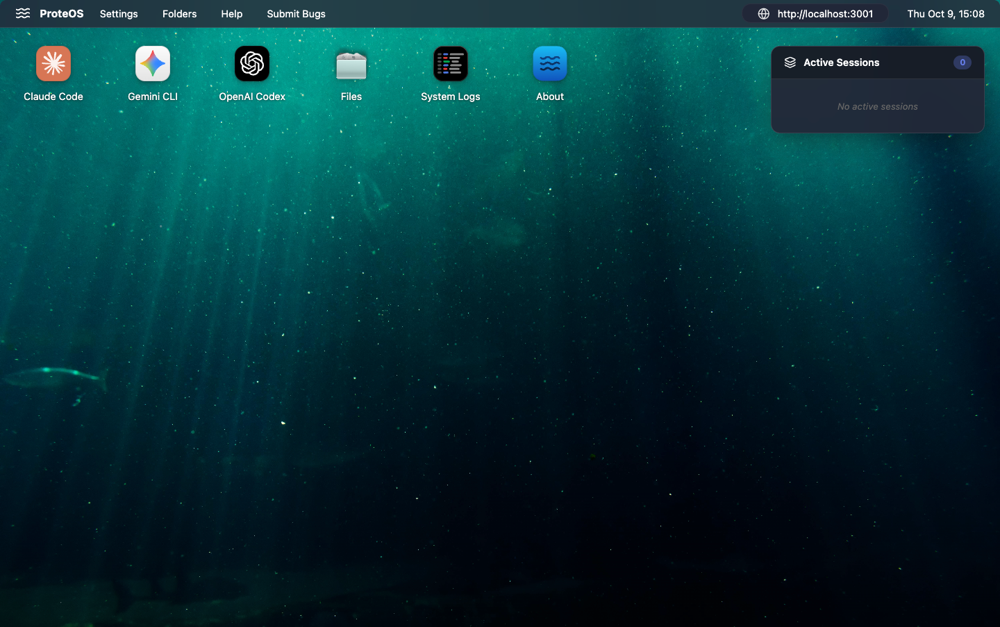
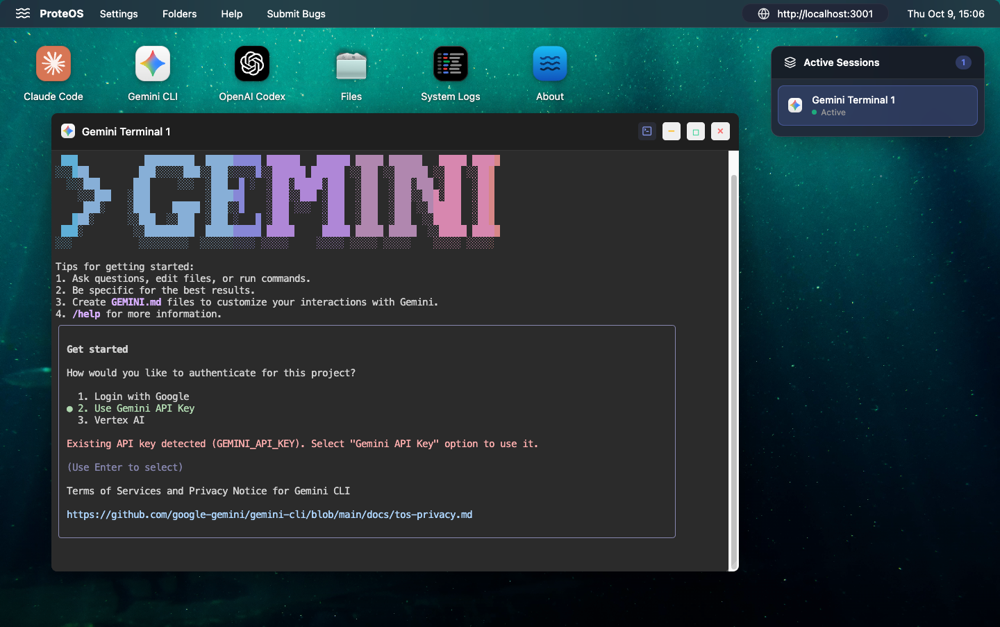

# 🌊 ProteOS (P/OS)

> *"Shape-shifting intelligence from the depths of virtualization"*

**ProteOS** is a self-hostable platform for running AI coding agents in strongly
isolated, per-user Firecracker microVMs. Spin up a machine, clone a repo, and let
Claude Code, pi.dev, Gemini, or Codex work in it — review the results through an in-browser
VS Code editor and terminals, or drive the whole loop headlessly from the `proteos`
CLI and CI.

Autonomous coding agents are powerful but risky to run loose on your laptop. **ProteOS** gives each agent a disposable, hardware-isolated microVM with its own kernel, workspace, and exposed ports — so you can run agents in parallel, safely, and either watch them in an ocean-themed browser desktop or script them through a CLI.

The name is derived from **Proteus (Πρωτεύς)**, the Greek sea god of shape-shifting,
wisdom, and prophecy. Just as Proteus could transform into any form, ProteOS adapts
seamlessly between multiple AI providers, embodying flexibility and intelligence
while keeping each one isolated in its own Firecracker microVM.

    


*ProteOS ocean-themed desktop, one window per machine and provider*


*A coding agent running in a dedicated terminal window on a machine*

## ✨ Features

### 🎭 Multi-AI Provider Support
- **🐋 Claude Code** (Anthropic Claude)
- **🔷 Gemini CLI** (Google Gemini)
- **⚡ OpenAI Codex** (OpenAI)

### 🔥 Firecracker microVMs
- **Isolated Machines**: each user owns one or more machines, every machine a
  full Firecracker microVM with its own kernel and rootfs
- **Strong Isolation**: hardware-level VM boundaries, not shared-kernel containers
- **On Demand**: machines are provisioned by the Go control plane and node-agent,
  and resources are only consumed while a machine is running

### 📁 File System
- **Persistent Storage**: each machine keeps its own workspace across restarts
- **File editing**: handled by **code-server** (a full VS Code in the browser),
  reached through the authenticated gateway at the per-machine editor subdomain.
  The old unauthenticated PoC file-browser/viewer was removed in Phase 8
  (decision #7) — see `plans/phase-8-implementation.md`.
- **Port preview**: forward and open a machine's listening ports through the
  gateway at a per-machine, per-port subdomain.

### 📊 System Monitoring
- **Live System Logs**: Dedicated window showing real-time operations and events
- **Log Filtering**: Filter logs by level (Info, Success, Warning, Error)
- **Auto-Scroll**: Optional automatic scrolling to latest log entries
- **Debug Visibility**: Track machine provisioning, connections, and failures instantly

### 🌐 Web-Based
- **No Installation**: Access from any browser
- **Remote Access**: Run on server, access from anywhere
- **Cross-Platform**: Works on Mac, Linux, Windows


## 🚀 Quick Start (local development)

ProteOS is a Go control plane + node-agent (Firecracker microVMs) with a React
(Vite) single-page app. The original Node/Express + Docker proof-of-concept
(`server/`, `public/`) was **retired in Phase 9** — the Go control plane and the
React desktop are the whole application now.

```bash
# 1. Bring up the dev database (Postgres).
task dev:db          # or: docker compose -f compose.dev.yml up -d

# 2. Run the stack (separate terminals): control plane, node-agent, web SPA.
task na:run          # node-agent
task cp:run          # control plane (depends on Postgres + node-agent)
task web:dev         # Vite dev server (proxies /api and /gw to the control plane)

# 3. Open the SPA.
open http://localhost:5173
```

Run `task --list` for every target (build, test, vet, fmt).

See **DEPLOYMENT.md** for the production (Proxmox / app-stack) deployment and
**RUNBOOK.md** for operations.

## ⌨️ Command-line interface

`proteos` drives ProteOS from the terminal — list machines, clone repositories,
run headless coding-agent tasks, and review/commit/push the results. It is built
to be driven by a coding agent as much as by a human: every read command supports
`--json` and exit codes are stable.

```sh
proteos machines ls
proteos project ensure --machine m-123 octocat/hello-world
proteos task run --machine m-123 --project hello-world --watch "add a /health endpoint"
proteos git commit --machine m-123 --project hello-world -m "add /health endpoint"
```

See **[cli/README.md](cli/README.md)** for install, authentication, the full
command reference, and exit codes.

## 🔑 API keys

Provider API keys (Claude, Gemini, OpenAI Codex) are no longer set via process
environment. They are entered per-user in the desktop **Settings → AI providers**
window, stored encrypted (OpenBao), and injected into the machine on demand. The
GitHub connection is managed from the same Settings window.

## 🤝 Contributing

Contributions are welcome! See **[CONTRIBUTING.md](CONTRIBUTING.md)** for dev
setup, the checks your change must pass, and PR guidelines, and please review our
**[Code of Conduct](CODE_OF_CONDUCT.md)**. For security issues, follow
**[SECURITY.md](SECURITY.md)** — do not open a public issue.

## 📄 License

ProteOS is released under the [MIT License](LICENSE).
